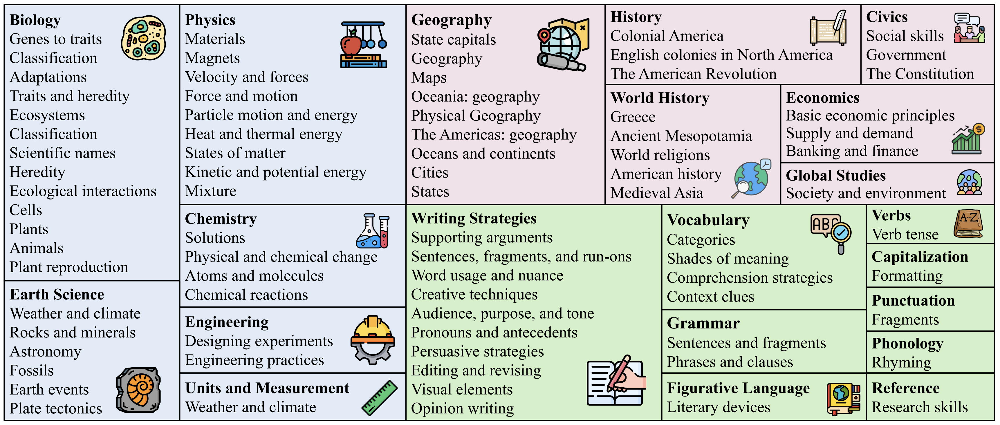

# ScienceQA: Science Question Answering

      

Data and code for NeurIPS 2022 Paper "[Learn to Explain: Multimodal Reasoning via
Thought Chains for Science Question Answering](http://lupantech.github.io/papers/neurips22_scienceqa.pdf)".


## About ScienceQA

We present **Science Question Answering (ScienceQA)**, a new benchmark that consists of 21,208 multimodal multiple choice questions with a diverse set of *science* topics and annotations of their answers with corresponding *lectures* and *explanations*. The lecture and explanation provide general external knowledge and specific reasons, respectively, for arriving at the correct answer.


ScienceQA, in contrast to previous datasets, has richer domain diversity from three subjects: **natural science**, **language science**, and **social science**. ScienceQA features 26 topics, 127 categories, and 379 skills that cover a wide range of domains.



We further design language models to learn to generate lectures and explanations as **the chain of thought (CoT)** to mimic the multi-hop reasoning process when answering ScienceQA questions. ScienceQA demonstrates the utility of CoT in language models, as CoT improves the question answering performance by 1.20% in few-shot GPT-3 and 3.99% in fine-tuned UnifiedQA.

For more details, you can find our project page [here](https://scienceqa.github.io/) and our paper [here](https://lupantech.github.io/papers/neurips22_scienceqa.pdf).


## Download the dataset

The text part of the **ScienceQA** dataset is provided in [data/scienceqa/problems.json](https://github.com/lupantech/ScienceQA/blob/main/data/scienceqa/problems.json). You can download the image data of ScienceQA by running:

```sh
. tools/download.sh
```

Alternatively, you can download **ScienceQA** from [Google Drive](https://drive.google.com/drive/folders/1w8imCXWYn2LxajmGeGH_g5DaL2rabHev?usp=sharing) and unzip the images under `root_dir/data`.


## Requirements

```
python==3.8.10
huggingface-hub==0.0.12
nltk==3.5
numpy==1.23.2
openai==0.23.0
pandas==1.4.3
rouge==1.0.1
sentence-transformers==2.2.2
torch==1.12.1+cu113
transformers==4.21.1
```

Install all required python dependencies:

```
pip install -r requirements.txt
```


## Run the GPT-3 (CoT) Model for ScienceQA

### Generate the image captions

We use the image captioning model to generate the text content for images in ScienceQA. The pre-generated image captions are provided in [data/captions.json](https://github.com/lupantech/ScienceQA/blob/main/data/captions.json).

(Optionally) You can generate the image captions with user-specific arguments with the following command, which will save the caption data in `data/captions_user.json`.

```sh
cd tools
python generate_caption.py
```

### Run the model

We build a few-shot GPT-3 model via chain-of-thought (CoT) prompting to generate the answer followed by the lecture and the explanation (**QCM→ALE**). The prompt instruction encoding for the test example in GPT-3 (CoT) is defined as below:


In our final model, we develp GPT-3 (CoT) prompted with two in-context examples and evalute it on the ScienceQA test split:

```sh
cd models
python run_gpt3.py \
--label exp1 \
--test_split test \
--test_number -1 \
--shot_number 2 \
--prompt_format QCM-ALE \
--seed 3
```

### Evaluate the results

Our final GPT-3 (CoT) model achieves a state-of-the-art accuracy of 75.17% on the test split. One prediction example is visualized bellow. We can see that GPT-3 (CoT) predicts the correct answer and generates a reasonable lecture and explanation to mimic the human thought process.


We can get the accuracy metrics on average and across different question classes by running:

```sh
cd tools
python evaluate_acc.py
```

We can run the following command to evaluate the generated lectures and explanations automatically:

```sh
cd tools
python evaluate_explaination.py
```

### Try different prompt templates

You can try other prompt templates. For example, if you want the model to take the question, the context, and the multiple options as input, and output the answer after the lecture and explanation (QCM→LEA), you can run the following script:

```sh
cd models
python run_gpt3.py \
--label exp1 \
--test_split test \
--test_number -1 \
--shot_number 2 \
--prompt_format QCM-LEA \
--seed 3
```


## License

[](https://lbesson.mit-license.org/)

This work is licensed under a [MIT License](http://creativecommons.org/licenses/by-nc-sa/4.0/).

[](https://creativecommons.org/licenses/by-sa/4.0/)

The ScienceQA dataset is licensed under a [Creative Commons Attribution-NonCommercial-ShareAlike 4.0 International License](http://creativecommons.org/licenses/by-nc-sa/4.0/).


## Cite

If the paper, codes, or the dataset inspire you, please cite us:

```latex
@inproceedings{lu2022learn,
    title={Learn to Explain: Multimodal Reasoning via Thought Chains for Science Question Answering},
    author={Lu, Pan and Mishra, Swaroop and Xia, Tony and Qiu, Liang and Chang, Kai-Wei and Zhu, Song-Chun and Tafjord, Oyvind and Clark, Peter and Ashwin Kalyan},
    booktitle={The 36th Conference on Neural Information Processing Systems (NeurIPS)},
    year={2022}
}
```

